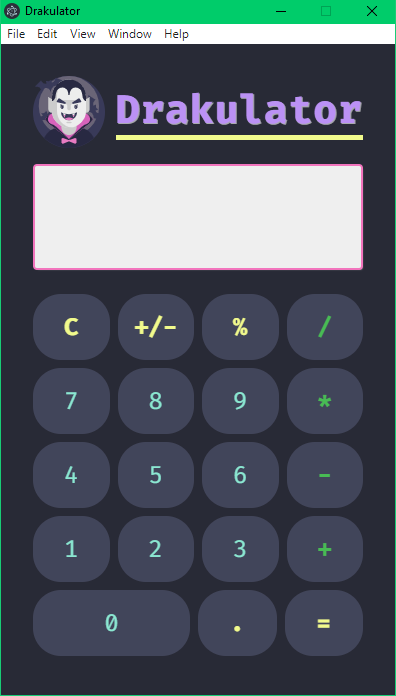

<h1 align="center"> 🦇 Drakulator 🧛‍♂️</h1>

> Calculator inspired by [Dracula theme](https://draculatheme.com/)

## 🚀 Technologies used

- [x] [JavaScript](https://www.javascript.com/)
- [x] [Electron](https://www.electronjs.org/) 

## 📸 Demonstration

<h1 align="center">
    
</h1>

## 👷‍♂️ Project installation

First you need to have [Node.js](https://nodejs.org/en/download/) installed, then **run the following command:**

``` git 

git clone https://github.com/LeonardoCampello-dev/Gym-Manager.git

```

**To install the dependencies**

``` node

npm install electron

```

## 💨 Running project

Run the following command to start the application in a development environment

``` node

npm start

```

## 📜 License

Released in 2020. This project is under the [MIT license](/LICENSE).

---

## Made with love by Leonardo Campello 💚
